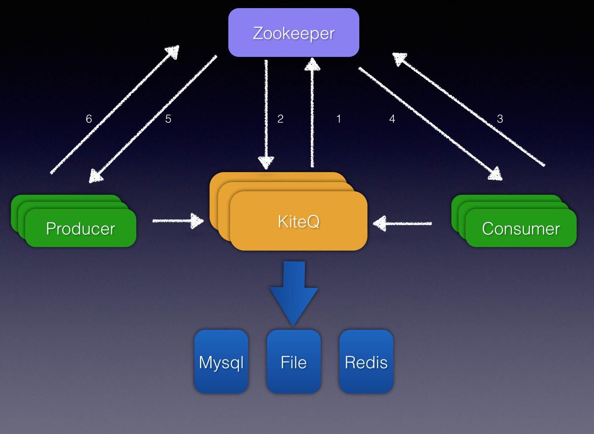

kiteq
=======

基于go+protolbuff实现的多种持久化方案的mq框架

#### 简介
    * 基于zk维护发送方、订阅方、broker订阅发送关系、支持水平、垂直方面的扩展
    * 基于与topic以及第二级messageType订阅消息
    * 基于mysql、文件存储方式多重持久层消息存储
    * 保证可靠异步投递
    * 支持两阶段提交分布式事务

#### 架构图
  

